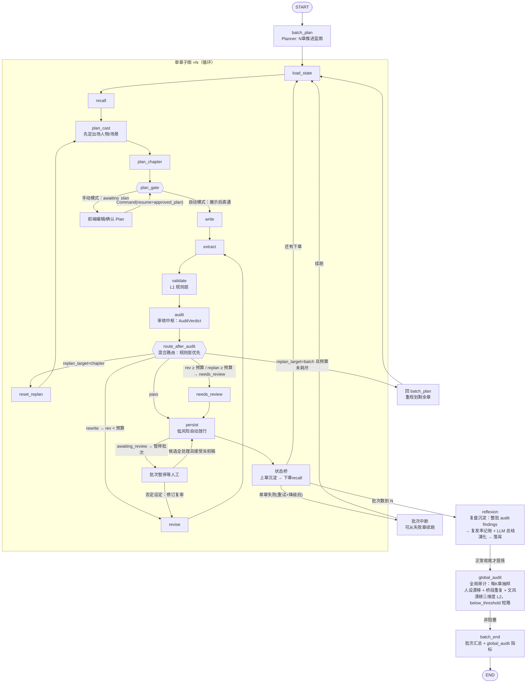

# Ai Ink 批量自动写作状态流转图 — Phase 0

> **用途**：LangGraph 工作流（plan.md §6.3）的运行蓝图 + 节点契约 + 异常分支。实现阶段 1 时本图直接变为代码骨架：节点函数、`ChapterState` / `BatchState` TypedDict、条件路由函数 `route_after_audit`。
>
> **配套**：数据契约见 `spec/schema.md`；评测样例见 `spec/conflict-samples.md`；批量设计见 plan.md §6.11，失败兜底见 §6.12。

## 1. 图拓扑（两级：批次主图 + 单章子图）

> 当前拓扑以以下 Mermaid 和 `state-flow.mmd` 为准；历史 PNG 尚未重绘。



## 2. 节点契约

> 节点间传**结构化对象**（plan.md §6.4），不传不断变长的自然语言 Prompt。类型 = 确定性节点（纯代码）/ LLM Agent / 角色。**LLM agent 不持写工具**（§6.2 数据流边界）：写库只在 `persist` 编排层；**Audit/Writer 持只读查证工具**（function calling，§10）——写稿/审核前可主动核实人物台账 / 伏笔 / 剧情线 / 硬约束，工具确定性执行、服务端断言归属、`tool_trace` 可审计。

| 节点 | 层级 | 类型 | 输入 | 输出 / 副作用 | 用到的工具 |
|---|---|---|---|---|---|
| `batch_plan` | 批次 | Planner（LLM） | 当前大纲 / 剧情线 / 伏笔状态 + N | `BatchPlan`：N 章推进蓝图（每章推进目标 / 收伏笔 / 大纲推进段） | `get_plot_status` |
| `load_state` | 章 | 确定性 | 任务参数（project_id、chapter_seq） | 项目设定 / 文风档案 / 题材包 / 字数目标 / 全量角色名单；并**重置上次尝试的瞬态标记**（error、needs_review、persisted、unresolved、revision_count、replan_count…）——同 thread 续跑时 LangGraph 合并 checkpoint，残留标记会让 write/extract 短路重蹈失败 | — |
| `recall` | 章 | 确定性 | 设定 + 前情 | `RetrievedContext` 的**宽部分**（与出场人物无关：硬约束、前情摘要、近期章头）+ token 预算 + `recall_stats` 召回占比；窄部分（人物状态快照 / 设定实体 / 事件术语）依赖出场名单，由 `plan_cast` 重取时补齐 | `search_world_facts` / `search_plot_events` / `get_entity_relations` / `get_chapter_context` |
| `plan_cast` | 章 | Planner（LLM） | 宽部分 `RetrievedContext` + 全量角色名单 + 大纲切片 | `ChapterCast`（`cast` 出场人物 / `locations` 场景地点）；**据此重取召回上下文**——人物状态快照、设定实体相关度、事件混合召回术语三处都依赖出场名单（此前只能拿按姓名排序的前 12 人），并带回 `replan_feedback` | — |
| `plan_chapter` | 章 | Planner（LLM） | `plan_cast` 重取后的 `RetrievedContext` + `ChapterCast` + 本章在 BatchPlan 的目标 | `ChapterPlan` | — |
| `plan_gate` | 章 | 确定性 + LangGraph interrupt | `ChapterPlan` + `writing_mode` | 自动模式直通；手动模式进入 `awaiting_plan`，作者可编辑后以 `Command(resume=approved_plan)` 从同一 checkpoint 继续，不重跑 Planner；replan 产生的新版本会再次确认 | — |
| `write` | 章 | Writer（LLM） | `RetrievedContext` + `ChapterPlan` | `draft`（章节草稿） | `inspect_character` / `inspect_facts`（只读查证，§10） |
| `extract` | 章 | Memory（LLM） | `draft` + `ChapterPlan` | `MutationCandidate[]` 写入待确认池（自动模式：低风险自动放行，§6.11） | `save_memory_candidates` |
| `validate` | 章 | 确定性（L1 规则层）+ L2 正文-台账语义比对 | `draft` + 图谱/事件/事实 + extract 候选 | `ValidationReport`——L1 硬证据（不被 LLM 绕过）+ **L2 语义比对 findings**（`summary.l2_major`，2026-08-13）：`ValidationService.validate` 只产确定性 L1（LLM 不能进校验器）；L2 在 `node_validate` 接线——extract 候选经 `ledger_l2.build_judgment_set` 判定集预滤（old==台账 且 new≠台账，空集零 LLM 短路）→ `validator_l2` 判 valid/invalid → 本地守卫（evidence 逐字 ∈ 内存 draft / key ∈ 判定集 / 置信度 ≥0.6）→ 严重度确定性映射 | `check_constraints` + `record_run` |
| `audit` | 章 | **审核中枢 Audit（LLM，第 4 类 agent）** | `draft` + ChapterPlan + 召回上下文 + extract 候选 + 上一节点 unresolved（L1/L2 major） | `AuditVerdict`：pass / rewrite / replan + L2 findings + reasons + confidence；**unresolved 按 conflict_key 合并**——audit 判定覆盖同键、L1/L2 不同键共存（`_merge_unresolved`，2026-08-13；原实现直接覆盖会把 L1/L2 major 丢出 revise 上下文） | `inspect_character` / `inspect_foreshadows` / `inspect_plot_threads` / `inspect_facts`（只读查证，§10） |
| `revise` | 章 | 角色（复用 Writer 模型） | `draft` + unresolved findings + 章节计划/transition + 前章结尾/近期章头 + 文风/字数/本章大纲 | 修订后 `draft` + 逐条 `fixed/cannot_fix/dispute`；回 extract → validate → audit，替换旧稿的记忆和报告 | — |
| `persist` | 章 | 确定性（编排层） | 确认候选 / 自动放行候选 | 事件/事实/状态/关系/伏笔落库（追加式）；`update_plot_threads` 推进大纲。**relation_change 落库先关闭同 (source,target) 有序对全部活跃旧行（`valid_to`=本章序）并透传候选 `valid_to`（临时盟约）**——保证「每对至多一条活跃」（2026-08-12）。**rewrite 分支（2026-08-12，§7.3）**：显式重写（`rewrite=true`）时自动放行分支**先失效该章旧记忆再写新**——`invalidate_chapter_memory` 关 facts/states/relations 时间窗（硬事实同时 expired）、删 events/开放伏笔/embeddings，同事务原子，无重复行；`_persist_candidates` 保持纯追加、`confirm_candidate` 永不失效 | `save_chapter` / `save_*` / `update_plot_threads` / `invalidate_chapter_memory` |
| `状态桥` | 章间 | 确定性 | 上章 persist 结果 | 上章沉淀 → 下一章 recall 输入（连续推进） | — |
| `reflexion` | 批次 | 确定性编排 + 复盘 Agent（LLM，§8.9） | 整批各章 audit findings（agent_runs.detail）+ 已有 active 经验 | 复发率记账（确定性）→ LLM 总结演化 → `writing_lessons` 落库（同 category update 演化 / 无则 create 分级 proposed/active）；短路（无发现 / 已复盘 / 全被覆盖）；失败不阻塞批次 | `record_run`（编排层写库，Agent 不直写） |
| `global_audit` | 批次 | 确定性编排 + 全局审计 Agent（LLM，§8.6） | 窗口内章节正文 + `characters.personality` 基线 | 每 K 章（`AUDIT_INTERVAL`）触发：确定性名提及抽样（cap 3，零提及短路落空报告）→ 1 次 LLM 判定（json_mode）→ `normalize_and_verify_findings` 确定性证据核验（引文逐字子串 / 章在窗口 / 角色在采样集 / 置信度 ≥0.6，丢弃其余）→ `global_audit_reports` 落库（findings 复用 Finding 形状，`persona/hint/local/L2`）；窗口 < K 短路（below_threshold 零成本）；LLM/解析失败写 status=failed 报告并推进 marker（非阻塞 + 有界） | `record_run`（编排层写库，Agent 不直写） |
| `batch_end` | 批次 | 确定性 | 批次全部章节 + reflexion / global_audit 指标 | 批次汇总报告（状态/成本/耗时 + reflexion 复盘指标 + global_audit 审计指标） | `commit_batch` |

## 3. 条件路由逻辑

```text
# 章内路由（单章子图）——混合路由（2026-08-07 确认）：规则层优先，LLM 兜语义
route_after_audit(state):
  if error: return "fail"
  if L1 critical 或 L2 major:
      return "needs_review" if revision_count >= max_revisions else "revise"
  if verdict == "rewrite" 或 verdict == "pass" 但仍有 major/critical findings:
      return "needs_review" if revision_count >= max_revisions else "revise"
  if verdict == "replan":
      if replan_count >= max_replans: return "needs_review"
      return "replan_chapter" if target=="chapter" 或非批次任务 else "replan_batch"
  return "persist" if verdict == "pass" else "needs_review"

# rewrite/replan 预算独立；干净通过的稿件不因历史轮次用尽而停下。
# route 节点记录实际去向、规则计数、审核建议，前端直接显示。
# 单章可逐次选择 auto/manual；manual 禁用批量生成。Plan 与正文是中栏内互斥的
# 全幅页面，通过 Redis Stream 发送 artifact_reset/delta/complete，前端直接呈现真实
# 模型增量。网关在返回 task_id 前建立 queued 流，并支持 Last-Event-ID 重放。

# 批次路由（单章结束后）
route_after_chapter(batch):
  if 本章 audit 判 replan_target=batch:
      return "replan_batch"     # 回 batch_plan 重规划剩余章（蓝图走偏，§6.11）
  if 本章 needs_review:
      raise BatchReviewError     # 暂停批次等人工（§6.11，已确认）
  if 本章重试+降级后仍失败:
      raise BatchChapterError    # 中断批次，可从失败章续跑（§6.11/§6.12，已确认）
  if batch.position < batch.size:
      return "next_chapter"     # 状态桥 → 下一章
  return "batch_done"           # 批次收尾 → reflexion（复盘沉淀）→ batch_end

# 机制说明（2026-08-07 落地）：章失败抛 BatchChapterError 而非优雅返回 batch_failed——
# LangGraph 只在图未达 END 时支持同 thread 再 invoke 从断点续跑；优雅走到 batch_end
# 图已 END、续跑会从头重跑整批。抛异常使 batch 线程 checkpoint 停在 chapter 节点
# （position 未推进），续跑从失败章继续、不重跑已完成章。runner.generate_batch
# catch 后置任务 failed；resume_thread 以 checkpoint 状态为基座续跑。
```

- 条件路由是**纯函数**，不在节点内部自由跳转——可观测、可测试；语义建议由 Audit 提供，规则只兜硬约束与预算（§6.11 混合路由）；
- `max_revisions = 2`（rewrite）/ `max_replans = 1`（replan）；同一 `conflict_key` 跨修订轮稳定，去重不计入轮次。

## 4. 修订循环契约（审核中枢驱动）

- **触发源**：`audit` 的 verdict=rewrite（不是校验报告直接触发）——Audit 输出 L2 findings + 建议 → revise 逐条修；
- findings 每项带**冲突作用域**（`scope`）：`local`（段落级，预算 1 轮） / `structural`（整章，预算 2 轮）；
- revise 注入 unresolved findings 和完整写作上下文，要求**逐条结构化响应**（`fixed / cannot_fix / dispute`）+ 修订后草稿；随后重新抽取、校验和审核，不能持旧候选落库。
- 修订预算耗尽且审核仍为 rewrite/replan 时，persist 标记 awaiting_review；作者明确续跑才接受当前稿。干净通过的稿件正常落库。
- 每条 finding 的"生死"（提出 → 修复 → 复验）落 `finding_status`；
- **修订超预算 → needs_review**：任何 awaiting_review 都暂停批次，审核通过并落库后才继续（§6.11）。

## 5. 异常分支与兜底（三层，plan.md §6.12）

| 场景 | 层 | 处理 |
|---|---|---|
| LLM 调用失败 / 超时 / 限流 | 调用层 | 指数退避重试（1s/2s/4s，上限 3 次）→ 模型降级链（主→备→默认）→ 思考模式超时降非思考 |
| 结构化输出解析失败 | 调用层 | 带"必须为 JSON"重试一次；仍失败 → 节点报错走任务层 |
| 向量 / 关键词召回失败（§7.2 事件混合召回） | 增强层 | **逐腿独立降级**：向量腿 encode/search 抛错 → 关键词腿独立工作；关键词腿术语空 → 向量腿独立工作；双腿全挂 → 纯关系召回兜底、`recall_stats={}`，**不阻塞生成** |
| 输出超限被截断 | 调用层 | 检测截断标记 → 重生成尾部（前文摘要 + 剩余目标），不让截断章落库 |
| 单节点异常 | 任务层 | `stage_log` 记录错误 → 节点失败；批次中断（若该章重试+降级后仍失败） |
| 重复投递 | 任务层 | `task_id` 幂等键 + DB 唯一约束，只执行一次 |
| 批次中断 / 服务重启 / 人工暂停 | 任务层 | Checkpointer 断点续跑（`thread_id = batch_task_id`），从失败章续跑，不重跑已完成章 |
| 校验不收敛（≥2 轮仍有 unresolved） | 任务层 | needs_review 转人工；非 critical 批次继续，critical 批次暂停 |
| 复盘提炼失败（LLM 报错 / 解析失败） | 增强层（§8.9） | **只记 error 不阻塞批次**：reflexion 是加分项非创作主线，批次照常 batch_end；失败批不走到 reflexion（batch_failed 直连 batch_end） |
| 同批次重复触发复盘 | 增强层（§8.9） | `_batch_already_reflexed` guard 短路跳过（幂等，不堆重复经验）；content_hash 字面 + LLM 语义去重兜底跨批 |
| 抽取坏数据（Pydantic 校验失败） | 数据层 | **拒绝但不崩**：结构化 JSON + Pydantic 强校验，坏候选标记无效不落库 |
| 并发写 | 数据层 | 项目级"记忆沉淀锁"（Redis SETNX）+ 乐观版本号；顺序固定：落章节 → 沉淀记忆 → 更新状态（§7.6） |
| 半写 / 重放 | 数据层 | 单章一个事务；persist 幂等（`conflict_key` / 唯一约束），重放不重复落库 |
| 长线问题（战力通胀/人设漂移/桥段重复等） | 批次收尾 | 不阻塞本章——global_audit 节点每 K 章周期审计输出全局审计报告（§8.6，人设漂移 + 桥段重复 + 文风漂移三维度，每维度各 1 次 LLM 判定、单维度失败不阻塞另一维度），LLM/解析失败只记 failed 报告并推进 marker（非阻塞 + 有界，防每批重审毒窗口） |

## 6. 与 5 类 Agent 的映射

```text
确定性节点（非 LLM）：load_state / recall / persist / 状态桥 / reflexion（确定性编排部分）/ global_audit（确定性编排部分）/ batch_end —— validate 节点从 2026-08-13 起不再纯确定性：`ValidationService.validate`（L1 规则层）仍零 LLM，但 `node_validate` 叠加 L2 正文-台账语义比对（`validator_l2` LLM，判定集预滤 + 本地守卫，见上表 validate 行）
LLM Agent：batch_plan + plan_cast + plan_chapter(Planner) / write(Writer) / extract(Memory) / audit(审核中枢 Audit) / validate 节点的 L2 语义比对（validator_l2）/ reflexion 复盘 Agent（提炼总结演化）/ 全局审计 Agent（人设漂移 + 桥段重复 + 文风漂移抽样判定，§8.6）
角色（非独立 agent）：revise —— 复用 Writer 模型，与 Audit 分离保证审核报告纯净可审计
```

> 审核路由边界（§6.11 混合路由）：Audit 输出 AuditVerdict 做语义路由（pass/rewrite/replan），但 L1 critical / L2 major（正文-台账语义矛盾）与轮次预算由确定性规则强制——Audit 不能绕过硬约束，也不能无限重写。L2 major 时 persist 视同 critical 分流待确认池 + awaiting_review（语义矛盾不自洽静默落库）。

> 能力边界（plan.md §6.2）：写作/规划/校验 agent 只拿组装好的上下文，**没有任何 agent 直接写库**；写状态经 extract 出候选，编排层（persist）确认或自动放行后落库。**例外只给只读查证工具**：Audit/Writer 经 function calling 主动核实（§10），不触碰写边界。

## 7. 编辑 / 校正 / 级联删除（阶段 3 切片：正文修改后的记忆动作，plan.md §7.3 编辑校正注记）

> 与重写（rewrite=true 整章重生成）不同，本切片处理**用户对已确认正文的轻量修改**。三端点均走编排层，Agent 不直写。

**① 轻编辑零动作**：`PUT .../chapters/{id}/content` 只更新 `content` + `version+1`，**不触发 LLM / 记忆动作**。用户只改语言风格 / 句子长短 / 标点时记忆不动——自动校正会因措辞抖动误伤/误增记忆，故校正必须显式触发。

**② 显式校正** `POST .../chapters/{id}/correct-memory`：
1. 对编辑后正文重新 `extract`（复用 `nodes.extract_candidates_from_draft`，与 `node_extract` 同一抽取路径，一次同步 LLM 调用）；
2. `diff_changeset` 对比该章已落库记忆 → 变更集 `{add, remove, keep}`；
   - **结构化记忆**（character_state / relation）按稳定键**精确匹配**（state：`character_id+field+old_value+new_value`；relation：`source_id+relation_type+target_id`）；
   - **自由文本**（event 摘要 / fact 内容 / foreshadow 描述）按归一化签名（去空白标点）+ 模糊相似（`SequenceMatcher` ≥ 0.85）；
   - **事件只按摘要匹配、不解析参与者**——抽取路径未消解参与者 UUID，按参与者比对会「规范化 UUID vs 原始人名」错配误删；
3. 变更集写**待确认池**（`apply_changeset_to_pool`）：add 原样入池、remove 转 `memory_removal` 候选（`payload={memory_type, memory_id, display}`）入池；按 `(kind, payload, source_chapter)` 幂等查重（任意状态），重跑不重复入池；keep 零动作。人工 confirm/reject 后生效（复用现有候选池端点），**不自动直落**——守住「校正不直写」边界。

**`memory_removal` 确认语义**（`apply_memory_removal`，幂等——目标已不存在视作成功）：events 硬删 + 向量删；facts `valid_to=seq` + `confirm_status="expired"`；states/relations `valid_to=seq` 关窗；开放伏笔硬删。校验约束由 `ensure_memory_candidate_kinds` 幂等重建（全名 `ck_memory_candidates_kind_enum`）。

**③ 级联删除** `DELETE .../chapters/{id}`：删除该章及其后**全部章节**（正文 + 记忆 + 池候选），进度回退到保留最大章（无保留则 0）。逐章复用 `invalidate_chapter_memory` 失效语义 + 清该章池候选 + 删章行；`autoflush=False` 下先 `flush()` 再查 `max(chapter_seq)`。**边界**：删 N 后 N+1 剧情引用已删事件会断层，故级联让作者从被删章重新生成；删除范围无进行中任务守卫（任务 checkpoint 引用章节，删除前应人工确保）。
> 工具调用方式（plan.md §10）：**MVP（阶段 1）** Audit/Writer 已持只读查证工具（function calling，确定性节点内 execute，`max_tool_calls=3` 预算封顶）；写工具仍是确定性节点内 Python 函数（persist 编排层）；**MCP Client** 接入外部数据源（热点榜单 / 素材检索 / 图片生成，2026-07-28 无状态协议），外部工具不暴露给 agent（编排层受控能力，热榜数据当灵感参考、不进记忆层）。热点榜单（扫榜）已落地（阶段 5，2026-08-16：DaoSearch Streamable HTTP，`integrations/rankings.py` sanitize + 降级，全局端点 `/internal/v1/rankings` 供**建书前**灵感面板展示——扫榜已整体前移，不再注入 `plan_chapter`/`batch_plan` 规划 prompt），素材检索 / 图片生成仍预留。
